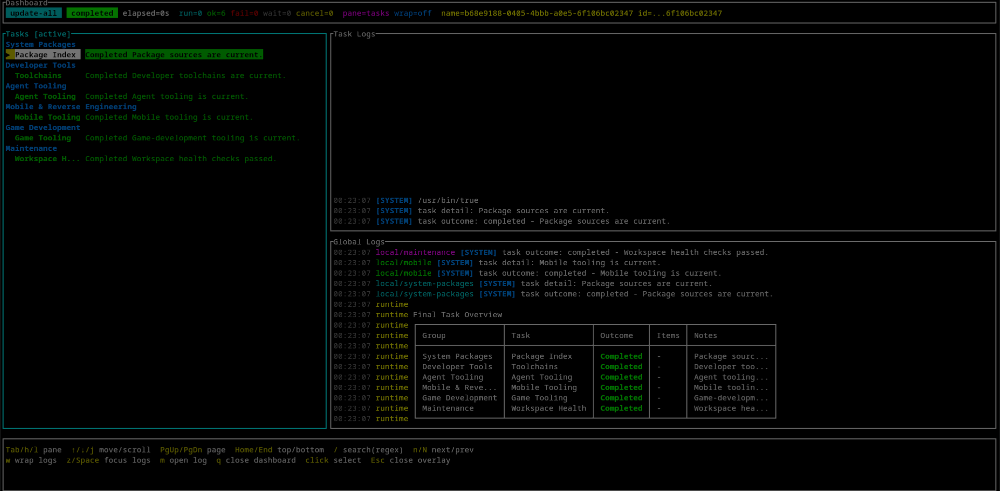

# Dev Tools

Reliable, inspectable tools for keeping a developer workstation current, fast, and reproducible across supported platforms.

Dev Tools is a product workspace, not a package manager and not a workstation configuration repository. Each command is independently installable and independently released.



| Product | Use it for |
|---|---|
| [`update-all`](docs/update-all.md) | Run supported package and tool updaters through one dependable plan and dashboard. |
| [`dev-cache`](docs/dev-cache.md) | Route and automatically maintain known disposable build caches on storage you select without moving source or deliverables. |
| [`sync-configs`](docs/sync-configs.md) | Converge explicitly selected files, directories, and structured overlays from a trusted manifest. |
| [`skills-sync`](docs/skills-sync.md) | Reconcile installed agent skills and their links from an explicit lock and provider selection. |

## Installation

Verified release artifacts are the supported installation path. Every product uses its own nested release tag, such as `update-all/v1.2.3`. A one-time Update All seed establishes the embedded trust root; authenticated native HTTPS then resolves and installs current stable products without Git, GitHub CLI, curl, wget, authentication, or a source checkout. The seed is not desired-version state and never needs to be refreshed.

On Linux x86-64, download `update-all-0.1.0-linux-x86_64` from the [`update-all/v0.1.0` release](https://github.com/FutureDevGuys/dev-tools/releases/tag/update-all%2Fv0.1.0), make it executable, and run:

```sh
./update-all-0.1.0-linux-x86_64 self install
~/.local/bin/update-all product install dev-cache
~/.local/bin/update-all product install sync-configs
~/.local/bin/update-all product install skills-sync
```

After that, `update-all` checks its authenticated stable manifest automatically no more than once every six hours and the public `builtin/dev-tools-*` tasks update only products already installed. The platform-neutral `sync-configs` artifact bundles its Python dependencies and requires Python 3.11 or newer.

| Platform | Status | Notes |
|---|---|---|
| Linux x86-64 | Supported | Signed artifacts, native updater checks, installation, rollback, and fresh-shell runtime acceptance. |
| Windows | Acceptance pending | Artifacts may be built, but runtime support is not claimed until native Windows acceptance passes. |
| WSL | Acceptance pending | Runtime support is not claimed until the WSL acceptance harness passes. |
| macOS | Unclaimed | Some updater definitions are portable, but product runtime acceptance is not complete. |

## Development

```sh
cargo fmt --all --check
cargo clippy --workspace --all-targets -- -D warnings
cargo test --workspace --locked
python -m pytest sync-configs/tests
python sync-configs/scripts/build_zipapp.py
```

See the [documentation index](docs/README.md), [security policy](SECURITY.md), [contribution guide](CONTRIBUTING.md), and [license terms](LICENSE-MIT) ([Apache-2.0](LICENSE-APACHE)).

## Non-goals

- Dev Tools does not choose personal packages, applications, host profiles, desktop policy, or private updater tasks.
- It does not synchronize credentials, browser state, sessions, tunnels, or complete environment snapshots.
- It does not install timers, daemons, watchers, scheduled tasks, or a background updater.
- It does not silently adopt old product names, paths, or configuration.
